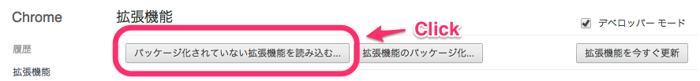
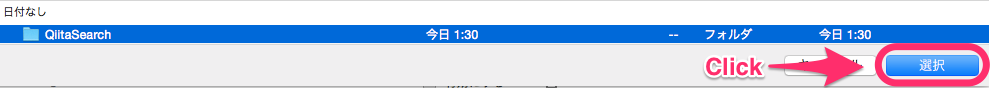

# QiitaSearch

## Usage

````
$ git clone git@github.com:syossan27/QiitaSearch.git
````

you should change Qiita:Team Domain.

ex.

js/search.js
```
var submit = document.getElementById("submit");
submit.addEventListener('click',function(){
	var search_word = document.getElementById("search").value;
	// ↓ Change Here!
	// var domain = "https://innova.qiita.com"
	var domain = "https://your-team.qiita.com"
	var url = domain+"/search?utf8=✓&sort=rel&q=-tag:日報+"+ search_word;
	window.open(url, '_blank');
	return false;
},false);
```



---



---


---
